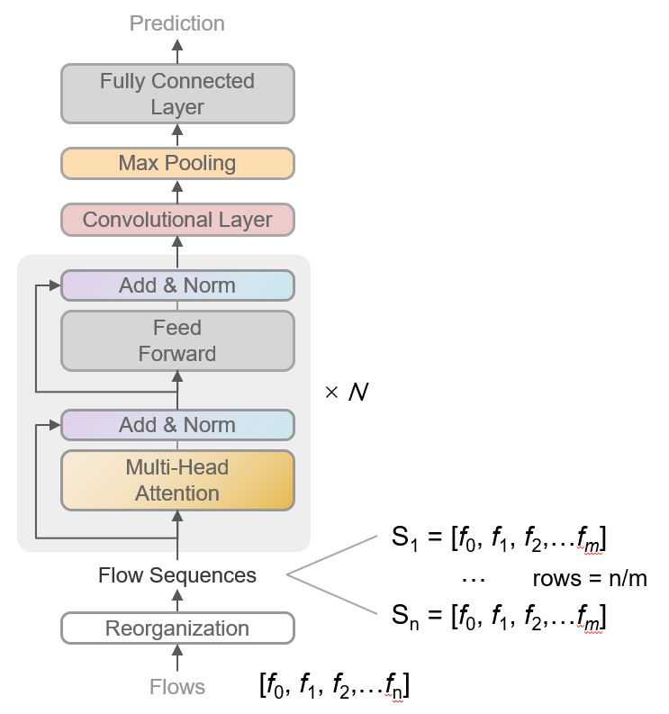

## 基于流量序列与Transformer的异常检测方法

### 简介

当前已有大量工作致力于从单个流量中检测异常事件，基于该类方法也有许多异常检测系统被开发。为了确保系统具备较高的召回率，需要牺牲精确度作为代价，从而导致用户难以从告警信息中获得有效的信息。本工作对流量数据进行序列建模，设计基于流量序列以及Transformer结构的异常检测网络。基于某公司发现攻击事件的三天流量日志数据进行实验，结果发现本工作提出的异常检测方法能够取得较高的精确度和召回度。

[代码地址](https://github.com/HongyuJiang/Netflow_Classification_Transformer/blob/main/IDS_Flow_Class.ipynb)

[数据集-P1](https://drive.google.com/file/d/11HhPzTeQ29bc1_vvx4KO7-C5_HSfNmS-/view?usp=sharing)
[数据集-P2](https://drive.google.com/file/d/1PUxq76ZcTjONJLrlP6vbgUDW9mIg6YFV/view?usp=sharing)

> 关键词：网络流量；序列建模；异常识别

### 数据描述

本工作基于某公司发现攻击事件的[三天流量日志数据](https://www.unb.ca/cic/datasets/ids-2018.html)进行设计和实验，攻击方包含约50台计算机，受害方包含某公司的5个部门，包含420台计算机以及30台服务器。攻击方进行了七种不同的攻击，包括蛮力攻击，心脏流血攻击，僵尸网络，DoS，DDoS，Web攻击以及内部网络的渗透。数据集包括捕获的每台计算机的网络流量和系统日志，以及使用CICFlowMeter-V3从捕获的流量中提取的80个特征。其中具有代表性的特征包括：
* 流量持续时间，流比特速度
* 前向\后向数据包总数，数据包大小，最大包大小
* 和FIN，SYN，RST，ACK相关的数据包总数
* 流空闲和活跃的时间

### 数据处理

1. 数据清洗
数据中可能出现缺失值或异常值，由于数据规模足够大，如果异常值或缺失值出现在正常流量中，将直接进行删除处理。如果出现在异常流量中，由于攻击者可能自定义数据包，将分情况进行处理。

2. 维度化简
保留数据流的发送方以及接收方的信息虽然能够提高预测的精度，但由于模型将过度拟合于发送方和接收方的IP，从而影响其在部署后对新攻击者的识别能力，于是数据流的发送方以及接收方的IP地址将被删除。

3. 数据标准化
为了使不同量纲的特征处于同一数值量级，减少方差大的特征的影响，使模型更准确，以及加快学习算法的收敛速度，这里作者对80个数据流特征进行标准化处理。

4. 序列构建
为了提高异常识别的精确度和召回度，作者将流量数据分为正常和异常流量，应用固定窗口构建以时间为联系的流量序列数据。设窗口大小为N，流量数据为$f_{i}$，序列数据$S_{0}$为$f_{0}, \{f_{1}...f_{N}\}$。序列由正常流量中采样则为正常序列，标注为1，反之则为0。

5. 均衡采样
通过对数据的统计，我们发现异常数据流与正常数据流的比例十分不平衡。异常数据流与正常流量的比例为1:5，虽然该比例不会影响模型的训练，但为了提高其在真实场景中异常识别能力，采用均衡采样的方法对异常数据的总量进行增加。具体为按照不同的攻击类型，对数据以序列为单位进行随机构建，数据元为已标注的异常流量。

### 任务建立
使用深度学习模型对流量序列进行分类以识别异常流量

### 模型建立

本工作旨在从流量序列发现异常流量。当前前沿工作发现Transformer对于序列数据具有优秀的特征提取能力，本工作提出基于Transformer的流量序列分类网络架构。该网络结构如右图所示，首先对原始流数据按照时间顺序进行组合，得到流序列。接着使用Transformer结构对流量序列的特征进行提取。在得到特征张量之后，使用一个卷积+池化层对特征进行降维处理。在最后使用一个全连接层对得到的特征进行分类。超参数设置：Transformer共包含3层，Transformer中前馈网络模型的维度大小为1024，注意力头大小为3。卷积层的卷积核大小为[3,4,5]，卷积核的数量为100个。此外，训练使用Adam优化器，学习率设置为0.001。

### 实验结果

对该网络结构进行实验分析，作者从实验数据中选择80%的数据作为训练数据集，20%作为验证数据集。序列长度设置为10，共包含5w条异常序列以及7w条正常序列。模型在训练20个Epoch后得到了收敛。异常检测的重要指标是召回度。实验结果如下表所示，我们能够发现，该网络结构在异常识别任务上表现十分突出。精确度和召回度分别能够达到99.9%。

表1：预测结果表 - 测试数据集
|       | Positive | Negative  |
| ----  | ----     | ----      |
| True  | 1.4 x 104  | 1.1 x 104   |
| False | 20      |    6  |

### 参考内容

1. [Sentiment Analysis with BERT and Transformers](https://curiousily.com/posts/sentiment-analysis-with-bert-and-hugging-face-using-pytorch-and-python/)
2. [Sequence-to-Sequence Modeling With NN.Transformer and Torchtext](https://curiousily.com/posts/sentiment-analysis-with-bert-and-hugging-face-using-pytorch-and-python/)
3. [CNN Text Classification Pytorch](https://github.com/Shawn1993/cnn-text-classification-pytorch)
